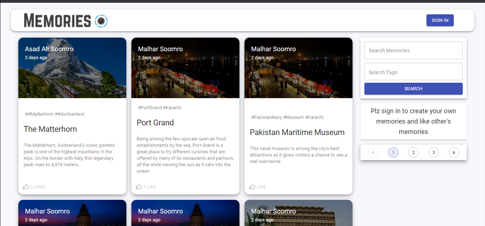
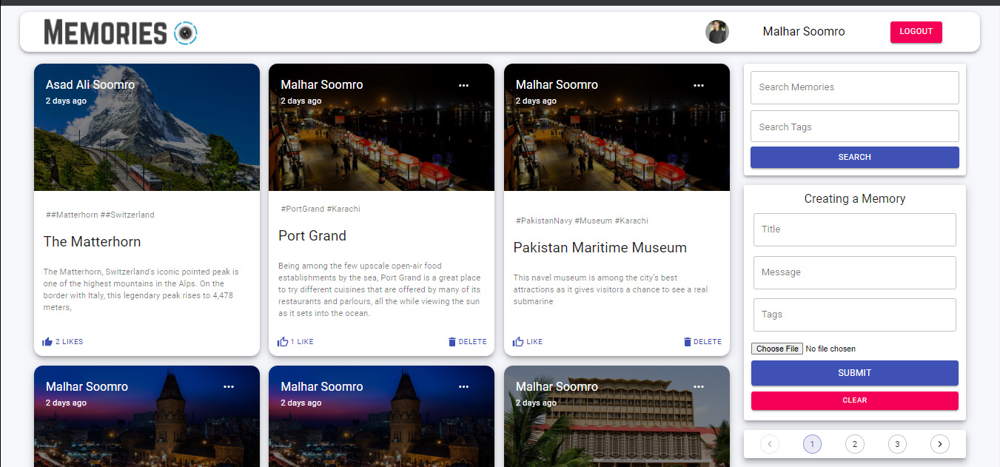
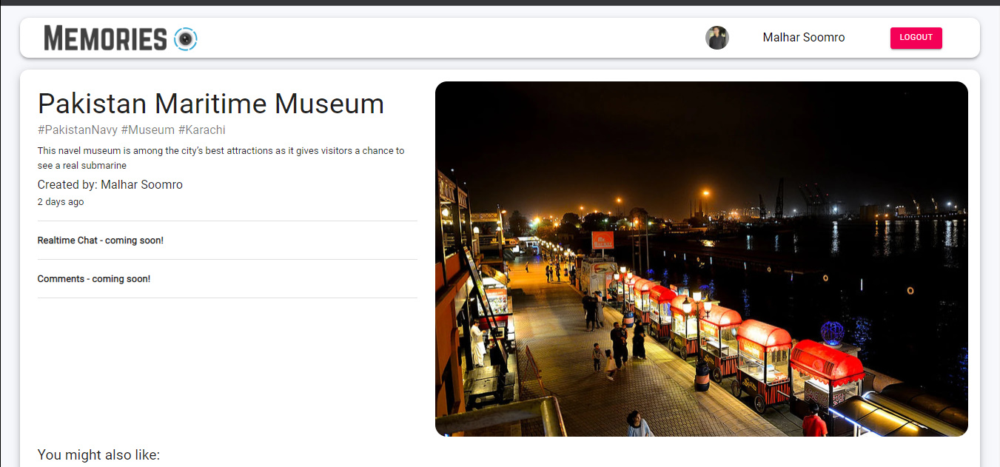
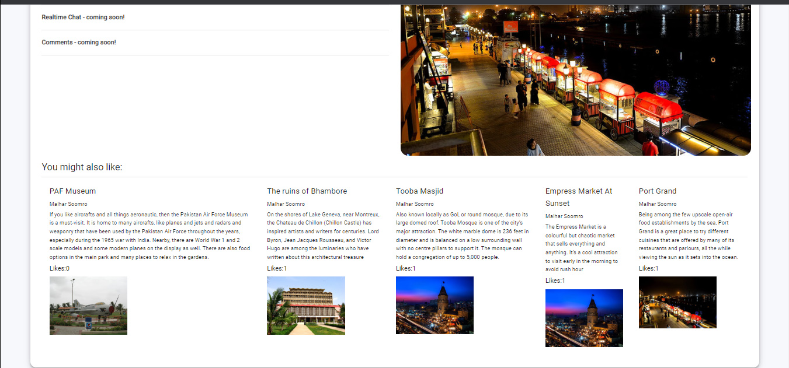
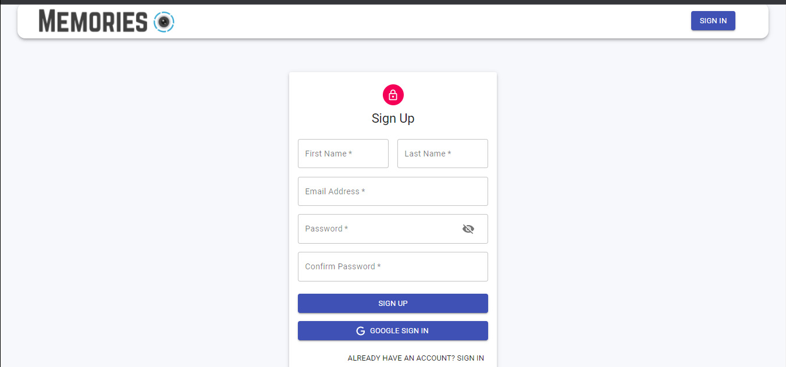
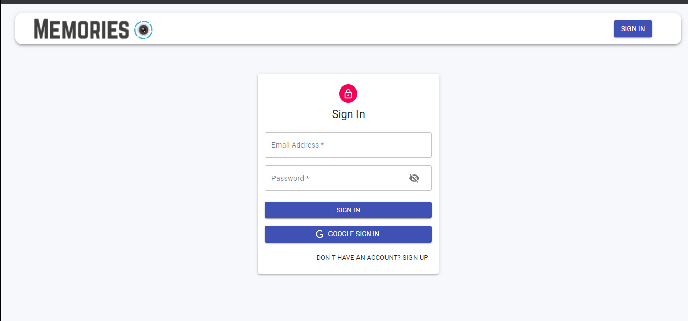
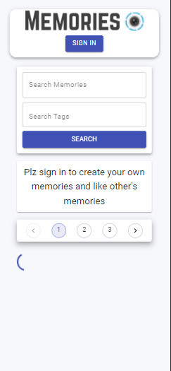
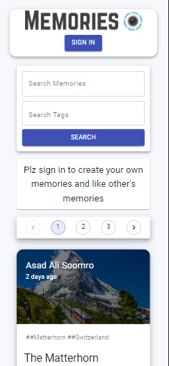
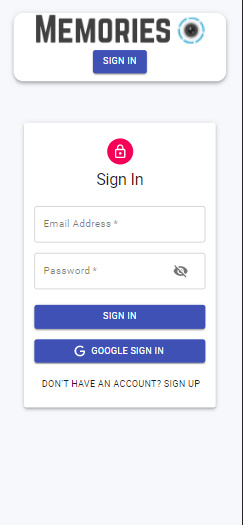
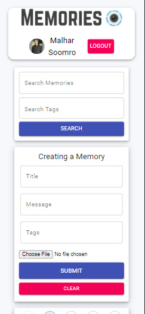

# MERN Memories Web App(Full Stack App)

### _Memories Web Application, where you can add, delete, update and like memories, and View each other's memories._

### Link : https://memories-we-project.netlify.app/

## Desktop Interface

## Mobile Interface

 

 

 

## Run Locally

**Fronted**

- Run this command `git clone https://github.com/Malhar-Soomro/fronted-of-memories-MERN-.git`

**Backend**

- Run this command `git clone https://github.com/Malhar-Soomro/backend-of-memories-MERN-.git`

- You are now in the dev environment and you can play around

## Features

- Authentication (Login/Signup)
- Authentication also with Google
- Create and Update, Like and Delete Memories
- View Other user's memories
- Recommended Posts will be displayed below the current post
- Mobile Responsive
- Pagination
- Validation

## Tech Stack

- HTML5
- CSS3
- Javascript and ES+6
- ReactJs
- Redux, Redux-Thunk
- NodeJs
- ExpressJs
- MongoDB Atlas
- Material-UI
